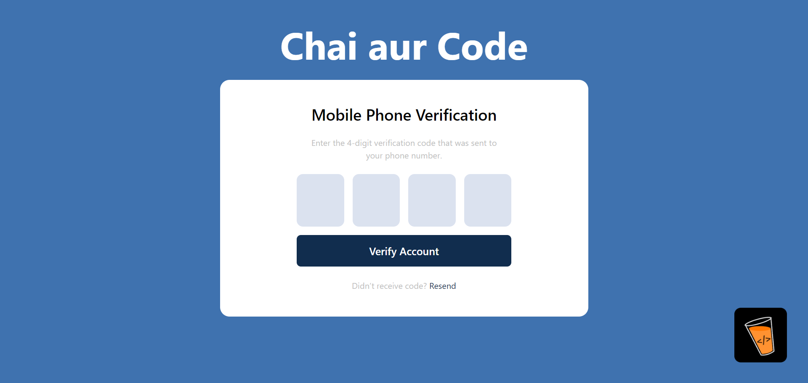
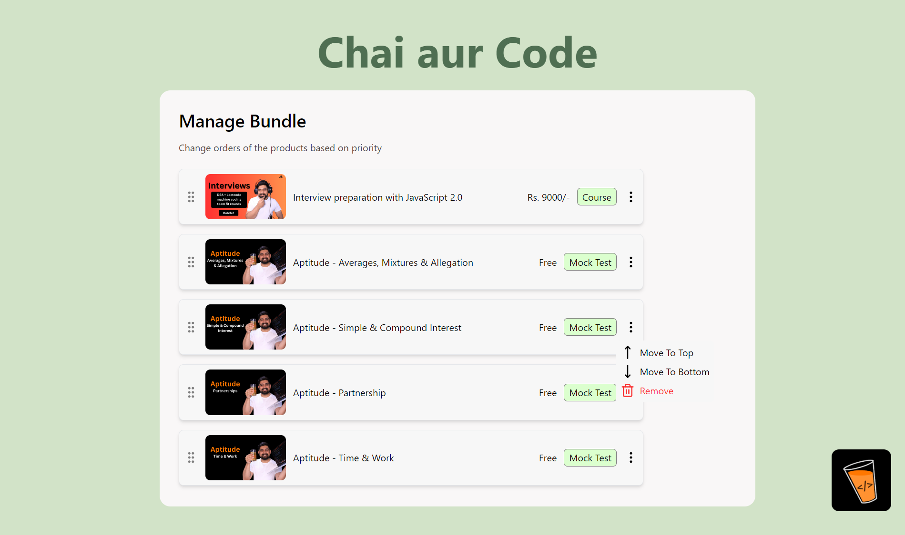
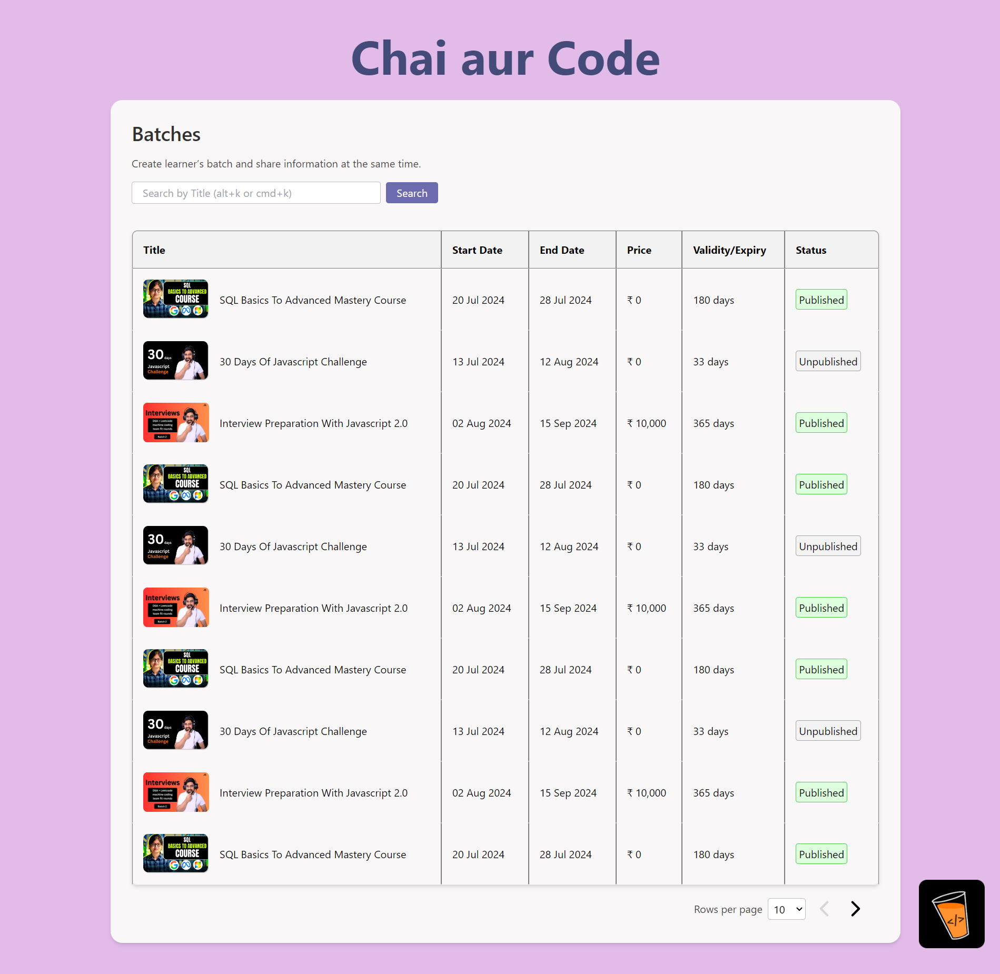

# ReUse

## `Build faster. Reuse more.`

### Component 1 : OTP Form (Valid OTP : 1234)

</img>

- A form to input a 4-digit OTP
- This component is built using React and vanilla javascript without any 3rd-party library
- The focus of the input fields automatically moves to the next input field when a user enters a `numeric value` and if the user clicks `backspace` button the value is removed and the focus is shifted to the previous input box.

### Component 2 : Drag and Drop Course Cards

</img>

- List of vertical course cards having drag and drop functionality built using dnd kit (https://dndkit.com/)
- Each card can be dragged and placed at any place within the list.
- Each card have three actions
  - `Move to Top` : When clicked the card moves to the top of the list
  - `Move to Bottom` : When clicked the card moves to the bottom of the list
  - `Remove` : When clicked the card is removed from the list

### Component 3 : Data Table

</img>

- This component is a paginated table for listing batches of a course and their statuses.
- Features
  - Search Bar to filter data based on title
  - Drop down menu at bottom of table to change the rows displayed per page
  - Pagination to divide the data into parts with buttons to go forward and backwards.
